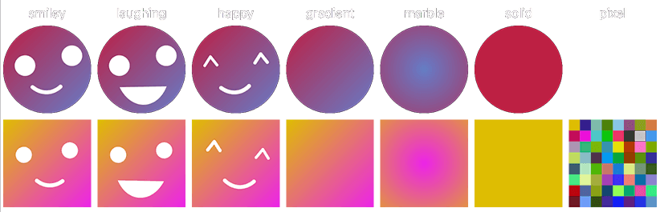

# plavatar
`plavatar/`: A library for generating **pla**ceholder **avatar**s (=plavatars). [-> JUMP TO DOCS](#plavatar-1)  
`plavatar-rest/` A stateless REST microservice wrapping plavatar for you (docker image available) [-> JUMP TO DOCS](#plavatar-rest)



## plavatar
A library for generating **pla**ceholder **avatar**s (=plavatars).  
Full Docs: https://pkg.go.dev/github.com/jonasdoesthings/plavatar

### Install
`go get github.com/jonasdoesthings/plavatar`  
Then you can import the `"github.com/jonasdoesthings/plavatar"` package.

### Usage
Basic Example with a built-in generatorFunc:
```go
import (
    "bytes"
    "github.com/jonasdoesthings/plavatar"
)

func generateMyAvatar() (*bytes.Buffer, string) {
    // Set-up a plavatar Generator instance
    avatarGenerator := plavatar.Generator{}
    
    // Configure the plavatar you want to generate 
    options := &plavatar.Options{
        Name:         "exampleSeed", // the seed to use
        OutputShape:  plavatar.ShapeSquare, // ShapeSquare or ShapeCircle
        OutputFormat: plavatar.FormatSVG,
        // OR if you want a PNG with the size of 512x512px:
        // OutputFormat: plavatar.FormatPNG,
        // OutputSize: 512,
    }
    
    // generate the avatar using the built-in Smiley generatorFunc and pass the options from above
    avatar, rngSeed, err := avatarGenerator.GenerateAvatar(avatarGenerator.Smiley, options)
    if err != nil {
        panic(err)
    }

    // returns the avatar as *bytes.Buffer and the used rngSeed as string
    return avatar, rngSeed
}
```

The plavatar Generator uses a passed generatorFunc to generate the avatar graphic.
The generatorFunc takes a svg canvas, a rng, the used rngSeed, and the generation options.
The generatorFunc then modifies the passed svg canvas.

Basic example with a custom generatorFunc:
```go
import (
    "bytes"
    svg "github.com/ajstarks/svgo"
    "github.com/jonasdoesthings/plavatar"
    "math/rand"
)

func CustomAvatar(canvas *svg.SVG, rng *rand.Rand, rngSeed int64, options *plavatar.Options) {
    canvas.Def()
    gradientColors := []svg.Offcolor{{0, "#FF0000", 1}}
    canvas.LinearGradient("bg", 0, 0, 100, 100, gradientColors)
    canvas.DefEnd()

    plavatar.DrawCanvasBackground(canvas, options)
    canvas.Line(-100, -10, 100, 10, "stroke: white; stroke-width: 23")
}

func generateMyCustomAvatar() (*bytes.Buffer, string) {
    avatarGenerator := plavatar.Generator{}
    options := &plavatar.Options{
        Name:         "exampleSeed",
        OutputSize:   256,
        OutputFormat: plavatar.FormatSVG,
        OutputShape:  plavatar.ShapeSquare,
    }
    avatar, rngSeed, err := avatarGenerator.GenerateAvatar(CustomAvatar, options)
    if err != nil {
        panic(err)
    }

    return avatar, rngSeed
}
```

### Testing
To run the go tests, use `go test -v ./...` in the root directory of the project.

## plavatar-rest
A stateless REST microservice wrapping plavatar for you (docker image available).

### API Endpoints
* `baseurl:port/laughing/<size>/<name>`
* `baseurl:port/smiley/<size>/<name>`
* `baseurl:port/happy/<size>/<name>`
* `baseurl:port/gradient/<size>/<name>`
* `baseurl:port/marble/<size>/<name>`
* `baseurl:port/solid/<size>/<name>`
* `baseurl:port/pixel/<size>/<name>` (*currently only available as square*)

Without name:
* `baseurl:port/laughing/<size>` and so on

With query params:
* `baseurl:port/laughing/<size>/<name>?format=svg`
* `baseurl:port/laughing/<size>/<name>?format=svg&shape=square`
* `baseurl:port/laughing/<size>/<name>?shape=square` and so on

### Parameters
* `size` the image's size in pixels. has to be min 16, max 1024
* `name` **optional**, the random number generator seed to use. given the same name the same picture will be returned
#### Query Params
* `format`**optional**, either png (default) or svg. svg returns the raw svg
* `shape` **optional**, either circle (default) or square.

### **If possible, use format=SVG.** 
Not only is format=SVG extremely faster, it also saves you a lot of bandwidth and latency. (A generated SVG is only ~2% the size of a 512px PNG)

### Docker Image
You can use our auto-built docker image `ghcr.io/jonasdoesthings/plavatar:latest`.  
All versions and details can be found here:
https://github.com/JonasDoesThings/plavatar/pkgs/container/plavatar

### Configuration
You can optionally supply a config file if you are not happy with the preset settings.  
By the default the program looks for a config file at `<running_folder>/config/plavatar.json`. If you want to use an
alternative location you can override this behaviour using the argument `--config <path_to_config>`. If there's neither
a config in the `config/` folder, nor you supply a path with `--config` the default configuration will be used.

#### Default configuration file

```json
{
  "dimensions": {
    "min": 128,
    "max": 512
  },
  "webserver": {
    "gzip": true,
    "http": {
      "enabled": true,
      "host": "0.0.0.0",
      "port": 7331
    },
    "https": {
      "enabled": false,
      "host": "0.0.0.0",
      "port": 7332,
      "cert": "testing.crt",
      "key": "testing.key"
    }
  },
  "caching": {
    "enabled": true,
    "ttl": "8h"
  },
  "metrics": {
    "enabled": false,
    "auth": {
      "enabled": true,
      "username": "",
      "password": ""
    }
  }
}
```

### Testing
To run the go tests, use `go test -v ./...` in the root directory of the project.

To generate a self-signed certificate for testing purposes you can
use `openssl req -newkey rsa:4096 -x509 -sha256 -days 3650 -nodes -out testing.crt -keyout testing.key`

For benchmarking, you can use the provided [k6 script](https://github.com/grafana/k6) under `scripts/k6_plavatar_benchmark.js`.
